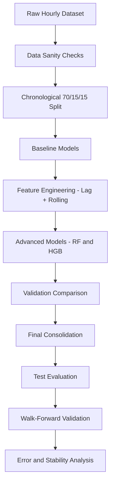

# Energy Production Forecasting  
## Leakage-Safe Time Series Regression Pipeline

Forecast hourly energy production using a structured, leakage-safe, phase-driven time-series regression workflow.


This repository emphasizes:

- Methodological rigor  
- Chronological integrity  
- Reproducibility  
- Robust validation  
- Deployment awareness  

Rather than chasing benchmark scores, this project focuses on building a production-realistic forecasting pipeline aligned with real-world ML practices.

---

# Why This Project Matters

Energy production forecasting directly impacts:

- Grid stability and load balancing  
- Capacity planning  
- Renewable integration (high variability systems)  
- Operational cost optimization  

In real-world forecasting systems, incorrect evaluation or data leakage can produce misleading performance. This project enforces strict chronological discipline and validates models under realistic operational constraints.

---

# High-Level Workflow



---

# Dataset

- Type: Hourly time-series (tabular)
- Target: `Production`
- Features: Time-derived signals + categorical context (source, season, day name)
- Source: Kaggle (download separately)

Place dataset files inside the `data/` directory (ignored by git).

Example structure:

```
project-regression/
├── data/
│   └── energy_production.csv
```

---

# Project Phases (Notebook-Driven)

Each notebook follows a structured approach:

Intent → Implementation → Results → Interpretation

1. Phase 00: Problem framing + metric selection (RMSE)  
2. Phase 01: Data understanding + sanity checks  
3. Phase 02: Chronological split (70/15/15) + leakage discipline  
4. Phase 03: Baselines (Mean, Ridge)  
5. Phase 04: Preprocessing pipelines (scaling + encoding inside sklearn Pipeline)  
6. Phase 05: Feature engineering (lag + rolling statistics, leakage-safe shifting)  
7. Phase 06: Advanced models (Random Forest, HistGradientBoosting)  
8. Phase 07: Error analysis (residual diagnostics + failure modes)  
9. Phase 08: Stability & robustness checks  
10. Phase 09: Final model consolidation (Train + Val → Test)  
11. Phase 10: Walk-forward validation (rolling-origin evaluation)

---

# Models Evaluated

- Mean baseline  
- Ridge Regression (pipeline-based)  
- Random Forest Regressor  
- HistGradientBoosting Regressor (Final Model)

HistGradientBoosting demonstrated the strongest balance between bias reduction, variance control, and stability across evaluation windows.

---

# Feature Engineering (Strict Leakage Control)

All forecasting features are constructed using only past information.

- `lag_1`
- `lag_24`
- `24-hour rolling mean` computed on shifted values

Strict rule enforced:

Features at time t use only information from t-1 and earlier.

No future leakage. No shuffled splits. Chronological integrity preserved throughout.

---

# Evaluation Strategy

- Primary metric: RMSE  
- Validation set: model comparison & selection  
- Test set: final unbiased evaluation  
- No shuffling  
- Walk-forward validation to verify temporal robustness  

---

# Key Results

## Fixed Chronological Split

- Mean baseline: ~4474  
- Ridge: ~4434  
- HistGradientBoosting (train-only) Test RMSE: ~**2381**  
- Final consolidated model (Train + Val → Test): ~**2339.96**  

## Walk-Forward Validation

- Mean RMSE across folds: **2313.87**  
- Std RMSE across folds: **175.62** 
- Best fold RMSE: **2113.3**  
- Worst fold RMSE: **2489.75**  

Interpretation:

Low variance across folds indicates the model does not depend on a single favorable split and generalizes consistently across time windows.

---

# Error Analysis and Stability Diagnostics

Beyond aggregate RMSE, the project includes:

- Residual distribution inspection (bias and skew detection)  
- RMSE by hour of day (peak-hour stress analysis)  
- RMSE by prediction bins (heteroscedasticity checks)  
- Temporal drift analysis across evaluation windows  

These diagnostics validate that improvements are operationally meaningful, not accidental.

---

# Production Readiness Design

This project is structured to mirror deployment constraints:

- Preprocessing + model encapsulated inside a single sklearn Pipeline  
- Deterministic feature engineering  
- Chronological evaluation discipline  

With minimal extension, this can be productionized via:

- Model serialization using joblib  
- API serving using FastAPI or Flask  
- Scheduled batch inference + periodic retraining  

---

# Repository Structure

```
project-regression/
├── data/                 # dataset files (ignored in git)
├── notebooks/            # phase-by-phase notebooks
├── README.md
├── requirements.txt
└── .gitignore
```

---

# How to Run

1. Clone the repository:

```
git clone https://github.com/sidnim12/project-regression.git
cd project-regression
```

2. Create a virtual environment (recommended):

```
python -m venv venv
```

Activate:

Windows:
```
venv\Scripts\activate
```

Mac/Linux:
```
source venv/bin/activate
```

3. Install dependencies:

```
pip install -r requirements.txt
```

4. Add dataset:

Download the dataset from Kaggle and place the CSV file inside `data/`.

5. Launch notebooks:

```
jupyter notebook
```

Run notebooks sequentially from Phase 00 through Phase 10.

Expected outputs:

- Validation RMSE comparison  
- Final Test RMSE  
- Walk-forward mean/std RMSE  
- Residual and stability plots  

---

# Author

Sai Sidhardh Nimishakavi  

Machine Learning practitioner focused on structured, leakage-safe time-series modeling and production-aligned evaluation frameworks.

---
# Connect With Me  
[](https://github.com/sidnim12)
[](https://www.linkedin.com/in/sai-sidhardh-nimishakavi-8132b6372)
